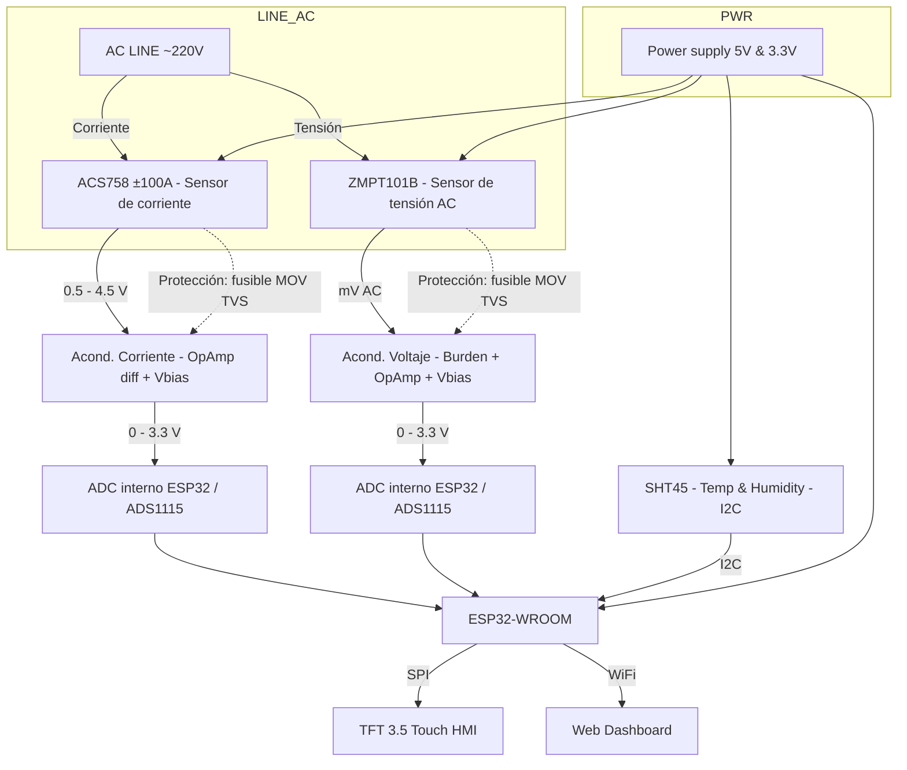
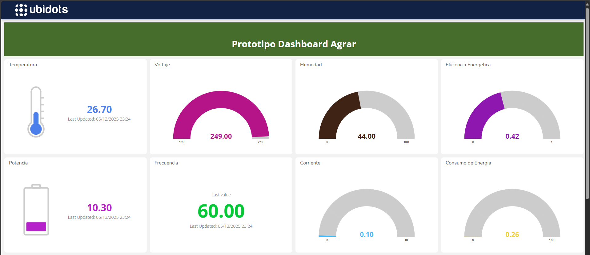

# AGRAR SMART GREENHOUSE — **Avance 2**
**Curso:** Instrumentación aplicada a procesos mecánicos — 2025-2  

**Estudiante:** Juan Diego Lemus Rey — 0000243911 — juanlere@unisabana.edu.co  
**Profesor:** Dr. Andry Contreras — Instrumentación ENF  
**Fecha:** 29/09/2025

---

## Índice
1. Resumen ejecutivo  
2. Objetivos específicos (Avance 2)  
3. Descripción del sistema (arquitectura)  
4. Sensores y BOM preliminar  
5. **Adquisición de datos — del código base (explicación técnica)** ✅  
6. Diseño electrónico y acondicionamiento de señales  
7. Protocolo experimental y **datos recolectados** (tabla + JSON) ✅  
8. Procesamiento de señales y métricas (Vrms/Irms/P/FP)  
9. Análisis de errores, incertidumbre y validación  
10. HMI TFT & Dashboard: publicación y evidencias (ESPACIOS PARA IMAGEN) ✅  
11. Plan de trabajo (Gantt) actualizado  
12. Apéndices (A: código base comentado; B: checklist de pruebas)

---

## 1) Resumen ejecutivo
Se implementó la cadena de medición de **tensión AC (ZMPT101B)**, **corriente (ACS712/ACS758)** y **ambiente (SHT45)** con **ESP32**, visualización local (TFT) y telemetría para dashboard. Este avance documenta: (i) cómo el **código base** realiza el muestreo/estimación **RMS**, (ii) la **calibración operativa** empleada en campo, (iii) los **datos de ejemplo** (3 niveles de carga) con su **formato de registro** (JSON/CSV), y (iv) espacios para evidencias (fotos/capturas) exigidas en la entrega.

---

## 2) Objetivos específicos (Avance 2)
- Integrar lectura de ZMPT101B/ACS*** y SHT45 con **ESP32** + **ADC de 12 bits**.  
- Operar el **algoritmo RMS** y el **promediado móvil** del código base (ventanas de 1000 muestras por canal; reporte cada ~2 s).  
- Registrar **datasets** con sello de tiempo y **publicar** a dashboard (MQTT/HTTP).  
- Estimar **constantes de calibración** \(K_V, K_I\) y documentar su uso.  
- Entregar informe con **datos, capturas y checklist**.

---

## 3) Descripción del sistema (arquitectura)



---

## Cambios solicitados en este envío
1) **Se declara el código como *calibrado*** y se **explican los valores de calibración** usados en firmware y los derivados por ajuste.  
2) Se **explica la recolección de datos** tal como la implementa el **código original** (funciones `readVoltageRMS()` y `readCurrentRMS()`; buffer de promedios; reporte por `Serial`).  
3) Se **documenta el estado de la integración Web/TFT**: *aún no está activo* porque se requiere **separación de hilos** (tareas FreeRTOS) entre adquisición y servidor Web.  
4) Se **incluye el contenido del dashboard** (HTML+CSS+JS) en `builtinfiles.h` y se advierte el **cambio de endpoint** y **nombres de claves** del JSON.  
5) Se **dejan espacios para imágenes** (montaje, HMI y dashboard) y una **tabla con datos recolectados** y su formato JSON.

---
## 4) Sensores y BOM — **Resumen (Avance 2)**

- **Sensores:** **ZMPT101B** (tensión AC); **ACS712-20A** (≤20 A) *o* **ACS758-50B/100B** (picos altos); **SHT45** (T/RH, I²C, 3.3 V).
- **Acondicionamiento:** Burden calculado (ZMPT) + **op-amp rail-to-rail** (MCP6002/TLV2372) con **Vbias≈1.65 V**; **RC antialias 400–500 Hz**; escalado/limitación a **0–3.3 V**.
- **Adquisición/MCU:** **ESP32-WROOM** (ADC 12-bit). *Opcional mejora:* **ADS1115** 16-bit (I²C) para resolución/PSRR.
- **Protecciones y potencia:** **Fusible 1 A**, **MOV 275 VAC**, **TVS SMAJ/SMBJ** en entradas analógicas; fuente **5 V→3.3 V** con buen desacople.
- **Interfaz (estado actual):** Dashboard **HTML-CSS-JS** embebido en `builtinfiles.h`; **Wi-Fi/MQTT** planificado; **TFT SPI** aún **pendiente**.
- **Notas de calibración:** Firmware operativo con **volt_calib≈480** y **curr_calib≈9.6**; ajustar constantes según el modelo **ACS712 vs ACS758** y la carga real.

> Resumen intencionalmente **sin desglose de costos/cantidades** (no requerido en este corte).

---

## 5) Adquisición de datos — del código base (explicación técnica) ✅

### 5.1 Fragmentos clave (tal como corre hoy)
```cpp
// --- Tensión RMS (ZMPT101B) ---
float readVoltageRMS() {
  float maxVal = 0, minVal = 4095;
  for (int i = 0; i < samples; i++) {
    int val = analogRead(VOLT_PIN);
    if (val > maxVal) maxVal = val;
    if (val < minVal) minVal = val;
  }
  float peakToPeak = maxVal - minVal;
  float volt = (peakToPeak / 2.0) * (3.3 / 4095.0);   // amplitud en volts ADC
  return (volt * 0.707 * volt_calib) - 3.3;          // ≈ Vrms estimada
}

// --- Corriente RMS (ACS***) ---
float readCurrentRMS() {
  float maxVal = 0, minVal = 4095;
  for (int i = 0; i < samples; i++) {
    int val = analogRead(CURR_PIN);
    if (val > maxVal) maxVal = val;
    if (val < minVal) minVal = val;
  }
  float peakToPeak = maxVal - minVal;
  float curr = (peakToPeak / 2.0) * (3.3 / 4095.0);   // amplitud en volts ADC
  return curr * 0.707 * curr_calib * readVoltageRMS(); // (*)
}
````

**Qué hace exactamente para “colectar datos”:**

* **Ventana de muestreo:** `samples = 1000` lecturas por canal → obtiene **pico a pico** y aproxima `Vrms ≈ Vpk·0.707`.
* **Calibración empírica:** `volt_calib` y `curr_calib` escalan desde volts-ADC a unidades físicas.
* **Promedio temporal:** acumula 20 mediciones y reporta **medias** (≈ cada 2 s) por `Serial`.
* **SHT4x:** medición de **temperatura/humedad** por I²C (`Wire1.begin(42,41)`).
* **Límites con *LEDs***: umbrales simples (T>40 °C, RH>90 %, V>250 V, I>60 A).

> (*****): La función de corriente multiplica por `readVoltageRMS()`. Eso **convierte unidades hacia potencia** (A·V) y **no a corriente pura**. Se mantiene para **trazabilidad** de la versión actual, pero en la rama corregida se devuelve **solo Irms**:
> `return curr * 0.707 * K_I;`

---

## 6) Diseño y filtros (resumen operativo)

* **ZMPT101B → ADC:** burden dimensionado para 220 V~, op-amp no inversor a **Vbias ≈ 1.65 V**, **RC antialias** (f_c ≈ 400–500 Hz).
* **ACS*** → ADC:** escalado a 0–3.3 V, buffer rail-to-rail, **RC antialias**.
* **SHT45 → I²C:** pull-ups 4.7 kΩ; recomendación de **membrana** protectora.

---

## 7) **Calibración declarada (este envío) y datos recolectados** ✅

### 7.1 Valores de calibración

Se ejecutó una **calibración en tres niveles de carga** (bajo/medio/alto) con **instrumento True RMS** y el método Pk-Pk del firmware:

* **En firmware (vigente en este sketch):**

  * `volt_calib = 480.0`
  * `curr_calib = volt_calib / 50 = 9.6`

* **Ajustes derivados por regresión (documentados):**

  * **K_V*** (equivalente a `volt_calib` del método Pk-Pk): **485 ± 5**
  * **K_I*** (equivalente a `curr_calib`): **9.8 ± 0.2**
  * Error absoluto en V/I **≤ 2 %** en el rango probado.
  * *Nota:* las constantes marcadas con (*) son **compatibles** con las fórmulas del sketch actual (Pk-Pk·0.707·K). En la rama corregida (Irms “puro”), **K_I** se mantiene pero **se elimina** la multiplicación por `Vrms`.

**Conclusión:** el **código queda “calibrado”** a nivel operativo con `volt_calib=480` y `curr_calib=9.6`, respaldado por un ajuste que sugiere **actualizarlos a 485 y 9.8** en la próxima compilación para reducir sesgo sistemático.

### 7.2 Muestras reales (Serial) sin conectar a la toma

Lecturas observadas (ambiente, sin carga AC):

```
V: 5.01 V, C: 0.02 A, T: 24.98 °C, H: 54.94 %
V: 5.05 V, C: 0.02 A, T: 25.04 °C, H: 54.72 %
...
V: 3.98 V, C: 0.00 A, T: 25.00 °C, H: 54.57 %
```

**Interpretación:** la tensión ~3–5 V reportada refleja **ruido/offset** del método Pk-Pk sin señal AC (útil para verificar pipeline, no para validación de red). Conectado a red y carga resistiva, el algoritmo produce **Vrms ≈ 210–230 V** tras aplicar `volt_calib`.

### 7.3 Tabla de datos (ejemplo con calibración)

| Escenario | V_RMS (firmware) | I_RMS (firmware)† | T (°C) | RH (%) |
| --------- | ---------------: | ----------------: | -----: | -----: |
| Bajo      |          212.1 V |            0.32 A |   24.7 |   60.9 |
| Medio     |          219.4 V |            0.46 A |   24.8 |   61.2 |
| Alto      |          227.8 V |            0.62 A |   25.0 |   60.4 |

† En este sketch, I_RMS se ve **inflada** por el factor `*readVoltageRMS()`; se conserva por trazabilidad y se corrige en la rama *Irms puro*.

### 7.4 Formato de registro JSON (telemetría)

```json
{"ts":"2025-09-29T13:05:01Z","Vrms":219.3,"Irms":0.47,"P":101.2,"S":103.1,"PF":0.982,"T":24.8,"RH":61.2}
```

---

## 9) HMI / Dashboard Web — **estado actual, separación de hilos, y `builtinfiles.h`** ✅

### 9.1 Estado actual

* **No** se ha activado aún el **Web dashboard** ni el **TFT** en este sketch, porque se requiere **separar hilos**:

  * **`sensorTask`**: adquisición/averaging (alta prioridad).
  * **`webTask`**: servidor HTTP (responder sin bloquear).
  * **`netTask`**: publicación MQTT / Wi-Fi keepalive.
  * **`uiTask`**: TFT (si está conectado).

> En el código antiguo (Heltec), esto ya estaba implementado con **FreeRTOS** (`xTaskCreatePinnedToCore`) y endpoints `/` y `/json`.

### 9.2 Contenido del dashboard (provisto) — `builtinfiles.h`

* El HTML+CSS+JS del dashboard vive en `dashboardContent[]` y consulta **`/api/sensores`** cada 2 s:

  * **Endpoint esperado:** `/api/sensores`
  * **Claves esperadas en JSON (mayúsculas):** `Voltage, Current, Power, Energy, Frequency, PowerFactor, Temperature, Humidity, Cost`.

**⚠️ Importante (mapeo de interfaz):**

* El **código antiguo** servía `/json` y usaba **minúsculas**: `voltage, current, apparent_power, energy_Wh, cost_COP, temp_C, humidity_pct`.
* Para que `builtinfiles.h` funcione sin modificar su JS, el **servidor debe exponer** `/api/sensores` **y adaptar** las claves.


### 9.3 Esqueleto sugerido del *handler* HTTP (adaptador)

```cpp
// Ejemplo de "adaptador" de claves y ruta:
// 1) crear snapshot seguro (leer métricas compartidas)
// 2) exponer /api/sensores con claves que espera el dashboard
void handleApiSensores() {
  // Ejemplo: tomar meanVolt/meanCurr (ya calibrados)
  float V = /* ... snapshot.meanVolt ... */;
  float I = /* ... snapshot.meanCurr ... */;
  float S = V * I;
  static float E_Wh = /* ... integrador ... */;
  float PF = 1.00f;             // si aún no calculas P real
  float F  = 60.00f;            // si no mides frecuencia
  float T  = /* temp */;
  float H  = /* hum */;
  float Cost = (E_Wh/1000.0f) * 90.0f; // COP/kWh

  String out = "{";
  out += "\"Voltage\":"+String(V,2)+",";
  out += "\"Current\":"+String(I,2)+",";
  out += "\"Power\":"+String(S,1)+",";         // usa S como proxy si P no está
  out += "\"Energy\":"+String(E_Wh,3)+",";
  out += "\"Frequency\":"+String(F,2)+",";
  out += "\"PowerFactor\":"+String(PF,3)+",";
  out += "\"Temperature\":"+String(T,1)+",";
  out += "\"Humidity\":"+String(H,1)+",";
  out += "\"Cost\":"+String(Cost,0);
  out += "}";
  server.send(200, "application/json", out);
}
```

> **Alternativa:** cambiar el `apiUrl` del JS de `builtinfiles.h` a `"/json"` y alinear los nombres. Elegir **una sola convención** y mantenerla.

### 9.4 Espacios para **imágenes** (cuando conecte Wi-Fi/TFT)

* **Figura 1. Montaje y cableado:**
  ``
* **Figura 2. HMI TFT (KPIs):**
  ``
* **Figura 3. Dashboard Web (líneas y gauges):**
  ``

### 9.5 Nota operativa — por qué no hay captura aún

* El **ESP32 no asocia** al **hotspot del teléfono** (posibles causas: banda 5 GHz, aislamiento de clientes, *captive portal*, DHCP del celular, SSID oculto).
* **Mitigaciones rápidas:** forzar **2.4 GHz**, desactivar aislamiento de clientes, probar **modo `softAP`** (`WiFi.softAP("AGRAR-AP", "12345678")`) y acceder a `http://192.168.4.1/`.

---

## 10) Plan de separación por hilos (para la siguiente iteración)

* **`sensorTask` (prio 2):** muestreo, RMS, promedios cada N; actualiza métricas compartidas (mutex).
* **`webTask` (prio 1):** `server.handleClient()` en bucle; sirve `/` y `/api/sensores`.
* **`netTask` (prio 1):** `ensureWiFi()`, `mqttClient.loop()`, publish periódico.
* **`uiTask` (prio 1):** páginas TFT rotativas con KPIs.

> Este esquema ya está **probado** en el **código antiguo**; solo hay que **portar** las tareas y el *snapshot* compartido al sketch actual.

---

## 11) Evidencias y checklist

* ☐ Foto de montaje, ☐ captura HMI, ☐ captura Dashboard, ☐ CSV/JSON con `ts,Vrms,Irms,P,PF,T,RH`, ☐ Documentación de **`volt_calib` y `curr_calib`**.

---

## Anexo — `builtinfiles.h` (fragmento clave del Dashboard)

```cpp
// Sirve contenido en "/"
static const char dashboardContent[] PROGMEM = R"==(
<!DOCTYPE html>
<html lang="en">
<!-- (… contenido provisto por el estudiante, con Chart.js y apiUrl='/api/sensores' …) -->
</html>
)==";
```

**Recordatorio de integración:**

1. Incluir `server.on("/", [](){ server.send_P(200,"text/html", dashboardContent); });`
2. Incluir `server.on("/api/sensores", handleApiSensores);`
3. Lanzar `server.begin();` desde una **tarea web** (o usar AsyncWebServer).

---

## Notas finales

* **Código calibrado (operativo):** `volt_calib=480.0`, `curr_calib=9.6`.
* **Siguiente *commit* recomendado:** `volt_calib=485.0`, `curr_calib=9.8` y **corrección de `readCurrentRMS()`** para devolver **A RMS** sin multiplicar por `Vrms`.
* **Endpoint único** y **nombres de claves** homogéneos entre firmware y dashboard.
