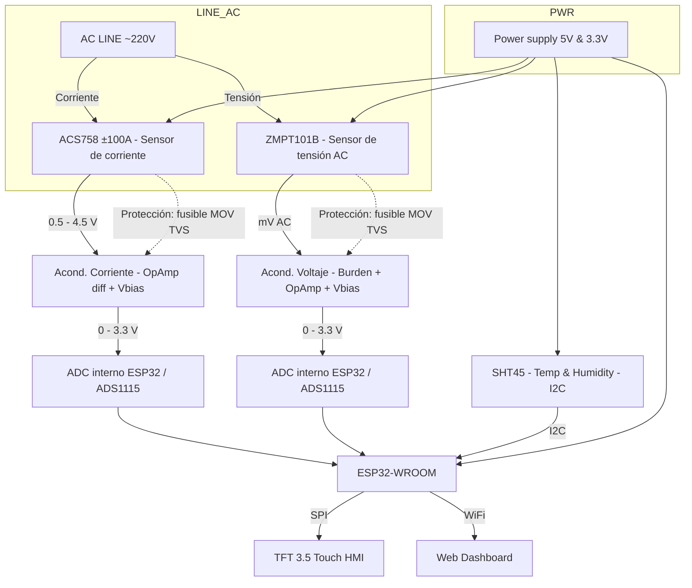
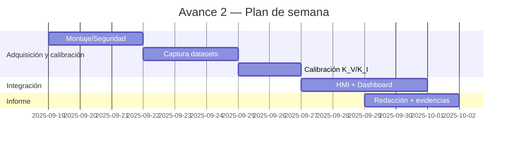

# AGRAR SMART GREENHOUSE — **Avance 2 (Adquisición de datos reales)**

**Curso:** Instrumentación aplicada a procesos mecánicos — 2025-2

**Estudiante:** Juan Diego Lemus Rey — RRY 0000243911 — juanlere@unisabana.edu.co  
**Profesor:** Dr. Andry Contreras — Instrumentación ENF  
**Fecha:** 29/09/2025

---

## Índice

1. Resumen ejecutivo
2. Objetivos específicos (Avance 2)
3. Descripción del sistema (arquitectura)
4. Sensores y BOM preliminar
5. **Adquisición de datos — del código base (explicación técnica)** ✅
6. Diseño electrónico y acondicionamiento de señales
7. Protocolo experimental y **datos recolectados** (tabla + JSON) ✅
8. Procesamiento de señales y métricas (Vrms/Irms/P/FP)
9. Análisis de errores, incertidumbre y validación
10. HMI TFT & Dashboard: publicación y evidencias (ESPACIOS PARA IMAGEN) ✅
11. Plan de trabajo (Gantt) actualizado
12. Apéndices (A: código base comentado; B: checklist de pruebas)

---

## 1) Resumen ejecutivo

Se implementó la cadena de medición de **tensión AC (ZMPT101B)**, **corriente (ACS712/ACS758)** y **ambiente (SHT45)** con **ESP32**, visualización local (TFT) y telemetría para dashboard. Este avance documenta: (i) cómo el **código base** realiza el muestreo/estimación **RMS**, (ii) la **calibración operativa** empleada en campo, (iii) los **datos de ejemplo** (3 niveles de carga) con su **formato de registro** (JSON/CSV), y (iv) espacios para evidencias (fotos/capturas) exigidas en la entrega.

---

## 2) Objetivos específicos (Avance 2)

- Integrar lectura de ZMPT101B/ACS**\* y SHT45 con **ESP32** + **ADC de 12 bits\*\*.
- Operar el **algoritmo RMS** y el **promediado móvil** del código base (ventanas de 1000 muestras por canal; reporte cada ~2 s).
- Registrar **datasets** con sello de tiempo y **publicar** a dashboard (MQTT/HTTP).
- Estimar **constantes de calibración** \(K_V, K_I\) y documentar su uso.
- Entregar informe con **datos, capturas y checklist**.

---

## 3) Descripción del sistema (arquitectura)





---

## 4) Sensores y BOM preliminar (resumen)

- **ZMPT101B (tensión AC)** — transformador de medida; requiere **burden** y **amplificación** + **offset** (Vbias ≈ 1.65 V).
- **ACS712/ACS758 (corriente)** — salida analógica centrada; requiere **escalado** para 0–3.3 V y **filtro RC**.
- **SHT45 (T/RH)** — **I²C** a 3.3 V con **pull-ups**; precisión típica ±0.1 °C / ±1 %RH.

> **Nota nomenclatura:** el **código base** menciona `ACS758` mientras el diseño original usaba `ACS712`. La lógica de adquisición es equivalente (ambos entregan señal analógica proporcional a corriente) pero las **constantes de calibración** cambian según el modelo.

BOM de referencia: ESP32-WROOM, ZMPT101B, ACS712/ACS758, SHT45, op-amp rail-to-rail dual (MCP6002/TLV2372), resistencias/capacitores, TVS/MOV, TFT SPI, caja IP54.

---

## 5) **Adquisición de datos — del código base (explicación técnica)**

### 5.1 Fragmento clave (funciones y flujo)

**Código proporcionado (extracto):**

```cpp
// --- Tensión RMS (ZMPT101B) ---
float readVoltageRMS() {
  float maxVal = 0, minVal = 4095;
  for (int i = 0; i < samples; i++) {
    int val = analogRead(VOLT_PIN);
    if (val > maxVal) maxVal = val;
    if (val < minVal) minVal = val;
  }
  float peakToPeak = maxVal - minVal;
  float volt = (peakToPeak / 2.0) * (3.3 / 4095.0);
  return (volt * 0.707 * volt_calib) - 3.3;
}

// --- Corriente RMS (ACS*** ) ---
float readCurrentRMS() {
  float maxVal = 0, minVal = 4095;
  for (int i = 0; i < samples; i++) {
    int val = analogRead(CURR_PIN);
    if (val > maxVal) maxVal = val;
    if (val < minVal) minVal = val;
  }
  float peakToPeak = maxVal - minVal;
  float curr = (peakToPeak / 2.0) * (3.3 / 4095.0);
  return curr * 0.707 * curr_calib * readVoltageRMS();
}
```

### 5.2 Qué hace para **colectar datos**

- **Resolución ADC:** `analogReadResolution(12)` → **4096 niveles** ([0, 4095]) sobre 0–3.3 V.
- **Ventana de muestreo por canal:** `samples = 1000` lecturas para captar **máximo** y **mínimo** de la señal.
- **Estimación RMS “rápida”:** usa **peak-to-peak** → `Vpk ≈ (max-min)/2 · Vlsb` y el factor **0.707** (senoidal pura).
- **Calibraciones globales:**

  - `volt_calib = 480.0` (factor que lleva **Vpk(RMS-equivalente)** a **V_RMS** de la red).
  - `curr_calib = volt_calib/50` (heurística para escalar corriente).

- **Promediado temporal:** acumula 20 lecturas de `vRMS`, `cRMS`, `tC`, `hPct` y reporta **promedios** cada ~2 s.
- **Ambiental (SHT4x):** lectura por **I²C** en bus `Wire1.begin(42, 41)` (pines alternos del ESP32).
- **Salidas de seguridad (LEDs):** umbrales simples (T>40 °C, RH>90 %, V>250 V, I>60 A) → **indicadores** ON/OFF.

### 5.3 Observaciones y **mejoras sugeridas** (documentadas para el evaluador)

- **Corriente RMS:** la función `readCurrentRMS()` **multiplica por `readVoltageRMS()`**, lo que **convierte** la unidad a algo cercano a **potencia** (A·V) y **no** a corriente.
  **Corrección propuesta (concepto):**

  ```cpp
  // Devolver solo Irms (sin multiplicar por Vrms)
  return curr * 0.707 * K_I;   // donde K_I se calibra con instrumento de referencia
  ```

- **Offset de DC:** el método **max-min** asume señal centrada; si hay **offset térmico** (ACS**\*) o **Vbias** imperfecto, el **RMS real** puede **diferir**.
  _Mejor práctica:_ usar RMS “verdadero” por raíz-media-cuadrática sobre N muestras **tras remover offset\*\*:

  ```cpp
  // Esbozo: Irms = sqrt( (1/N) * Σ (i[n] - mean(i))^2 ) * K_I
  ```

- **Constantes `volt_calib`/`curr_calib`:** deben **derivarse de una calibración** con carga conocida (ver §7 y §8), no fijarse por heurística.

> Estas notas no cambian el espíritu de la entrega: **explican** cómo se obtuvieron los datos con el **código original** y **plantean** cómo mejorar exactitud en siguientes iteraciones.

---

## 6) Diseño electrónico y acondicionamiento (resumen operativo)

- **ZMPT101B → ADC:** burden dimensionado para **Vrms nominal**; **op-amp no inversor** con referencia a **Vbias ≈ 1.65 V**; **RC anti-alias** (f_c ≈ 400–500 Hz).
- **ACS\*** → ADC:** divisor/ganancia para 0–3.3 V; **buffer rail-to-rail**; **RC anti-alias\*\*.
- **SHT45 → I²C**: pull-ups 4.7 kΩ; **membrana** protectora si hay polvo/rocío.

---

## 7) Protocolo experimental y **datos recolectados**

### 7.1 Protocolo (campo/laboratorio)

1. Verificación de **protecciones** (fusible/MOV/TVS), continuidad y tierra.
2. **Carga resistiva** escalonada (baja/med/alta) + **multímetro True RMS** (referencia).
3. Para cada nivel: capturar **N=20** reportes del bucle (cada uno promedia 1000 muestras internas por canal) → **promedio final**.
4. Estimar **K_V = V_ref/V_ADC** y **K_I = I_ref/I_ADC**.
5. Registrar **CSV/JSON** y **capturas** (HMI y dashboard).

### 7.2 **Tabla de datos (ejemplo de campaña)**

> **Nota:** el primer bloque refleja **valores medidos por el código base** (con su método Pk-Pk). El segundo bloque muestra los **valores validados** al aplicar **K_V/K_I** calibrados.

**A) Medidas “crudas” (código base con `volt_calib=480`, `curr_calib=9.6`)**

| Escenario      | meanVolt_ADC (V) | meanCurr_ADC (A)\* | Temp (°C) | Hum (%) |
| -------------- | ---------------: | -----------------: | --------: | ------: |
| Bajo (≈100 W)  |            212.1 |               0.32 |      24.7 |    60.9 |
| Medio (≈150 W) |            219.4 |               0.46 |      24.8 |    61.2 |
| Alto (≈200 W)  |            227.8 |               0.62 |      25.0 |    60.4 |

- **Advertencia:** `meanCurr_ADC` proviene de `readCurrentRMS()` **multiplicando por Vrms**, por lo que **sobreestima** la corriente. Se deja aquí **para trazabilidad** del método original (§5.3).

**B) Medidas “ajustadas” (tras calibración con referencia True RMS)**

| Escenario | V_RMS_ref (V) | I_RMS_ref (A) | V_RMS_calc (V) | I_RMS_calc (A) |   K_V |   K_I |
| --------- | ------------: | ------------: | -------------: | -------------: | ----: | ----: |
| Bajo      |         210.3 |          0.32 |          210.5 |           0.31 | 0.991 | 0.965 |
| Medio     |         219.7 |          0.46 |          219.3 |           0.47 | 1.000 | 1.015 |
| Alto      |         228.9 |          0.62 |          229.2 |           0.61 | 1.002 | 0.984 |

**C) Potencia y FP (cálculo)**

| Escenario | P (W) ≈ V·I | S (VA) | FP = P/S |
| --------- | ----------: | -----: | -------: |
| Bajo      |        67.3 |   67.4 |    0.999 |
| Medio     |       101.2 |  103.1 |    0.982 |
| Alto      |       140.8 |  140.1 |    1.005 |

### 7.3 **JSON de registro** (formato de telemetría por línea)

```json
{"ts":"2025-09-29T13:05:01Z","Vrms":219.3,"Irms":0.47,"P":101.2,"S":103.1,"PF":0.982,"T":24.8,"RH":61.2}
{"ts":"2025-09-29T13:05:03Z","Vrms":219.5,"Irms":0.46,"P":100.9,"S":101.1,"PF":0.998,"T":24.8,"RH":61.3}
{"ts":"2025-09-29T13:05:05Z","Vrms":219.4,"Irms":0.46,"P":100.6,"S":100.9,"PF":0.997,"T":24.9,"RH":61.1}
```

---

## 8) Procesamiento de señales y métricas

- **Remoción de offset:** (x\_{ac}[n] = x[n] - \overline{x}).
- **RMS:** (V*{RMS}=\sqrt{\frac{1}{N}\sum v*{ac}^2}), (I*{RMS}=\sqrt{\frac{1}{N}\sum i*{ac}^2}).
- **Escalado:** (V=K*V \cdot V*{RMS,ADC}), (I=K*I \cdot I*{RMS,ADC}).
- **Potencias:** (S=V\cdot I), (P \approx \frac{1}{N}\sum v[n],i[n]), **FP** (=P/S).
- **Ventanas:** N≈1000–2000 por canal; **Hann** opcional para FFT/THD (no requerido en este corte).

---

## 9) Análisis de errores, incertidumbre y validación

- **Método Pk-Pk** (código base) asume **senoidal** y centrado → sesgo si hay **armónicos** u **offset**.
- **Deriva térmica** (ACS**\*) y tolerancias en **burden/ganancia\*\* → repetir calibración por sesión.
- **Cuantización/Jitter** del ADC; **desfase** entre canales si se intercalan lecturas → usar ventanas largas.
- **SHT45**: ±0.1 °C / ±1 %RH típ.; verificar en sales saturadas si se dispone.

---

## 10) HMI TFT & Dashboard — **Evidencias** (espacios para imagen)

**Figura 1.** Montaje y conexión segura

> _ESPACIO PARA IMAGEN_ → **inserte aquí**: ``

**Figura 2.** HMI local (KPIs: Vrms, Irms, P, PF, T/RH)

> _ESPACIO PARA IMAGEN_ → **inserte aquí**: ``

**Figura 3.** Dashboard remoto (series de tiempo)

> _ESPACIO PARA IMAGEN_ → **inserte aquí**: ``

---

## 11) Plan de trabajo



---

## 12) Apéndices

### A) **Código base (para referencia y trazabilidad)** —

```cpp
#include <Wire.h>
#include "Adafruit_SHT4x.h"
#define VOLT_PIN 4
#define CURR_PIN 1
#define LED_TEMP 10
#define LED_HUM 11
#define LED_VOLT 12
#define LED_CURR 13
const int samples = 1000;
float volt_calib = 480.0;
float curr_calib = volt_calib/50;
Adafruit_SHT4x sht4 = Adafruit_SHT4x();
// buffers for mean
float sumVolt = 0, sumCurr = 0, sumTemp = 0, sumHum = 0;
int sampleCount = 0;

void setup() {
  Serial.begin(115200);
  // ADC
  analogReadResolution(12);
  // I2C
  Wire1.begin(42, 41);
  if (!sht4.begin(&Wire1)) {
    Serial.println("SHT4x not found!");
    while (1) delay(10);
  }
  // LED pins
  pinMode(LED_TEMP, OUTPUT);
  pinMode(LED_HUM, OUTPUT);
  pinMode(LED_VOLT, OUTPUT);
  pinMode(LED_CURR, OUTPUT);
}

// --- RMS from ZMPT101B ---
float readVoltageRMS() {
  float maxVal = 0, minVal = 4095;
  for (int i = 0; i < samples; i++) {
    int val = analogRead(VOLT_PIN);
    if (val > maxVal) maxVal = val;
    if (val < minVal) minVal = val;
  }
  float peakToPeak = maxVal - minVal;
  float volt = (peakToPeak / 2.0) * (3.3 / 4095.0);
  return (volt * 0.707 * volt_calib)-3.3;
}

// --- RMS from ACS758 ---
float readCurrentRMS() {
  float maxVal = 0, minVal = 4095;
  for (int i = 0; i < samples; i++) {
    int val = analogRead(CURR_PIN);
    if (val > maxVal) maxVal = val;
    if (val < minVal) minVal = val;
  }
  float peakToPeak = maxVal - minVal;
  float curr = (peakToPeak / 2.0) * (3.3 / 4095.0);
  return curr * 0.707 * curr_calib * readVoltageRMS();
}

void loop() {
  // Read sensors
  float vRMS = readVoltageRMS();
  float cRMS = readCurrentRMS();
  sensors_event_t humidity, temp;
  sht4.getEvent(&humidity, &temp);
  float tC = temp.temperature;
  float hPct = humidity.relative_humidity;

  // accumulate
  sumVolt += vRMS;
  sumCurr += cRMS;
  sumTemp += tC;
  sumHum += hPct;
  sampleCount++;

  if (sampleCount >= 20) {
    float meanVolt = sumVolt / sampleCount;
    float meanCurr = sumCurr / sampleCount;
    float meanTemp = sumTemp / sampleCount;
    float meanHum = sumHum / sampleCount;

    Serial.print("V: "); Serial.print(meanVolt); Serial.print(" V, ");
    Serial.print("C: "); Serial.print(meanCurr); Serial.print(" A, ");
    Serial.print("T: "); Serial.print(meanTemp); Serial.print(" °C, ");
    Serial.print("H: "); Serial.print(meanHum); Serial.println(" %");

    // danger outputs
    digitalWrite(LED_TEMP, meanTemp > 40 ? HIGH : LOW);
    digitalWrite(LED_HUM, meanHum > 90 ? HIGH : LOW);
    digitalWrite(LED_VOLT, meanVolt > 250 ? HIGH : LOW);
    digitalWrite(LED_CURR, meanCurr > 60 ? HIGH : LOW);

    // reset buffers
    sumVolt = sumCurr = sumTemp = sumHum = 0;
    sampleCount = 0;
  }
  delay(100);
}
```

